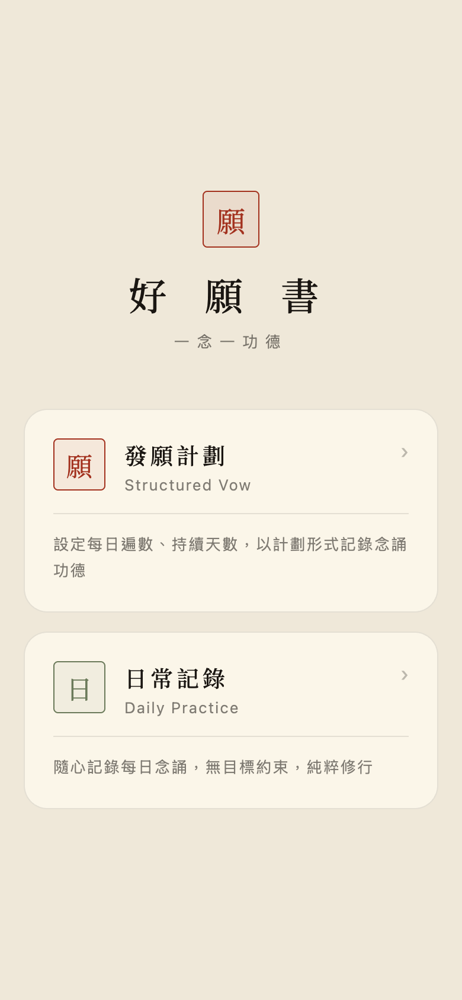
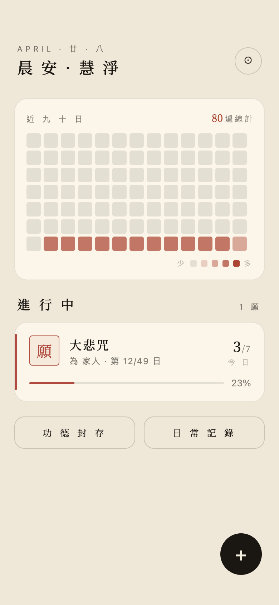
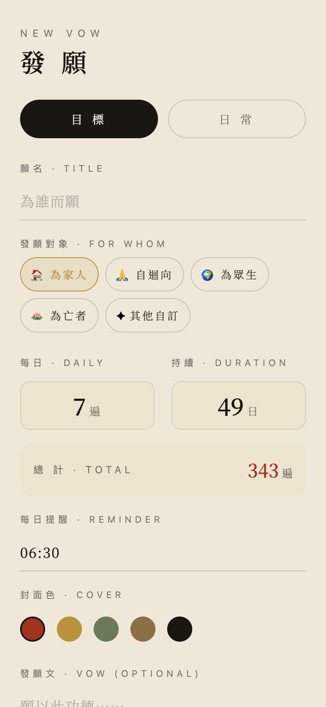
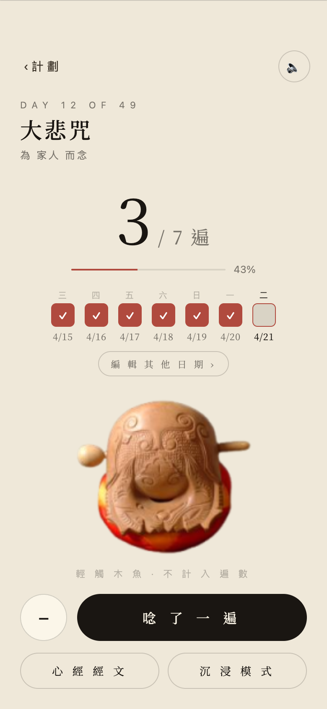
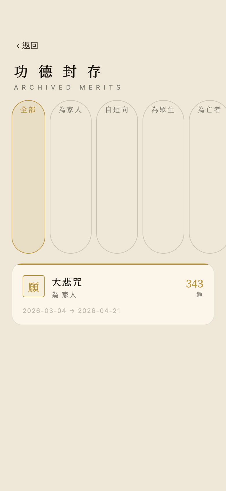
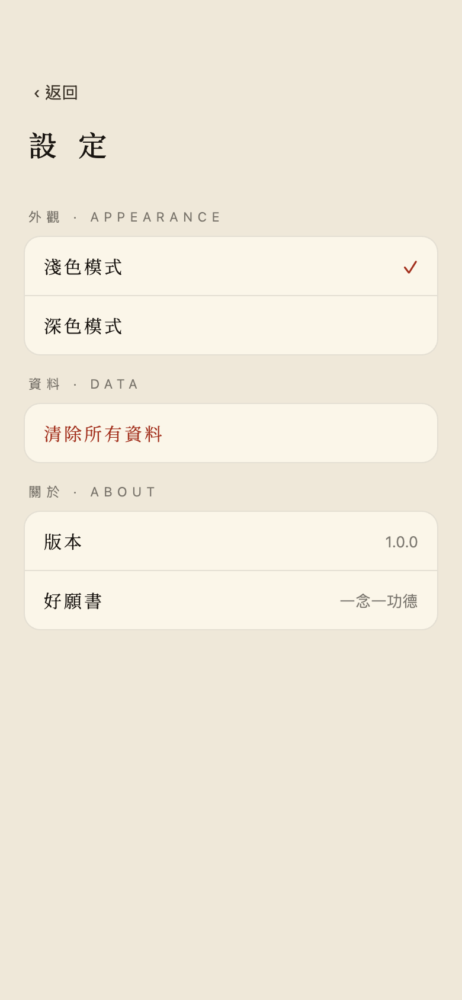
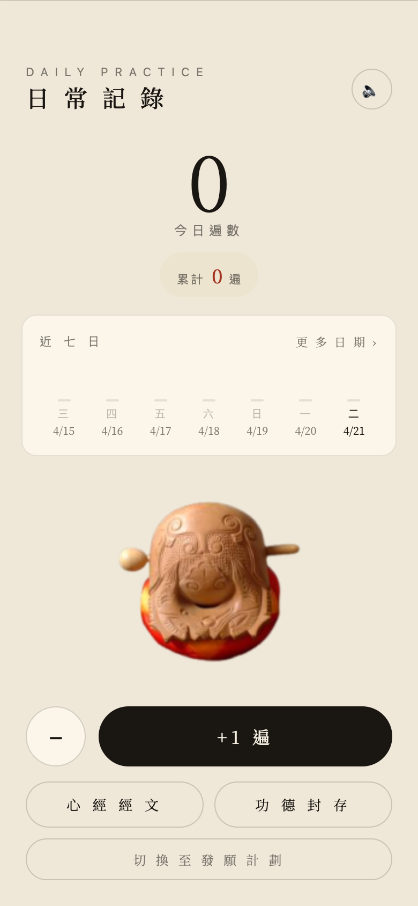

# 好願書 · HaoYuanShu

> 一念一功德 · A mindful practice tracker for daily recitation

「好願書」是一款以禪意素雅美學為核心的念誦記錄 app，協助使用者建立每日修行儀式，追蹤願力的累積。提供「發願計劃」與「日常記錄」兩種模式，配合木魚音效、發願迴向與功德封存。

支援 iOS 與 Android（Expo / React Native）。

---

## 功能特色

- **雙模式入門**：結構化的發願計劃 vs. 自由的日常記錄，依使用者需求選擇
- **沉浸念誦介面**：全螢幕專注模式，木魚音效、節奏動畫
- **每日提醒**：local notification 排程，於指定時間召喚修行
- **熱力圖追蹤**：以日曆熱力呈現持續性，支援連續日數統計
- **功德封存**：完成的發願自動歸檔，依迴向類型分類（為家人 / 自迴向 / 為眾生 / 為亡者 / 其他）
- **淺色 / 深色模式**：可手動切換主題
- **本地優先**：資料儲存於 AsyncStorage，無需註冊、無需上傳

---

## 截圖

| 入門 | 首頁 | 建立計劃 |
|---|---|---|
|  |  |  |

| 今日念誦 | 沉浸模式 | 圓滿迴向 |
|---|---|---|
|  |  |  |

| 功德封存 | 設定 | 日常記錄 |
|---|---|---|
|  |  |  |

---

## 技術架構

| Layer | Stack |
|---|---|
| Framework | React Native 0.81 · Expo SDK 54 |
| 語言 | TypeScript（strict mode） |
| 狀態管理 | Zustand |
| 導航 | React Navigation v7（native stack） |
| 持久化 | AsyncStorage |
| 音訊 | expo-av |
| 提醒 | expo-notifications |
| 字型 | Noto Serif TC（@expo-google-fonts） |

---

## 專案結構

```
haoyuanshu/
├── App.tsx                  # 入口 · 字型/hydrate/ErrorBoundary
├── app.json                 # Expo 設定
├── src/
│   ├── components/          # 共用 UI（木魚、印章、紙紋背景、ErrorBoundary…）
│   ├── navigation/          # PlanNavigator / DailyNavigator / Root
│   ├── screens/             # 9 個畫面（onboarding / home / today / immersive…）
│   ├── store/               # Zustand store + AsyncStorage 持久化
│   ├── theme/               # 雙主題 design tokens
│   ├── types/               # 型別定義
│   └── utils/               # 通知排程、日期工具
├── assets/                  # icons、字型、木魚 / 提示音
└── screenshots/             # 流程截圖
```

---

## 在本機執行

需要 Node 18+、Xcode（iOS）或 Android Studio（Android）。

```bash
# 1. 安裝依賴
npm install

# 2. 啟動 Metro
npx expo start --dev-client

# 3. 安裝到實機（第一次需要 Apple ID 簽名）
npx expo run:ios --device
# 或
npx expo run:android --device
```

> 第一次裝到 iPhone 時，需要至「設定 → 一般 → VPN 與裝置管理」信任開發者憑證。

---

## 設計理念

- **禪意配色**：以宣紙白、墨黑、朱砂、金箔、苔蘚綠為主，避免高飽和螢光
- **襯線字體**：使用思源宋體強化儀式感
- **少干擾**：去除過多動畫與通知打擾，把注意力留給念誦本身
- **本地優先**：不收集、不上傳、不註冊，所有功德資料都在裝置上

---

## License

MIT
